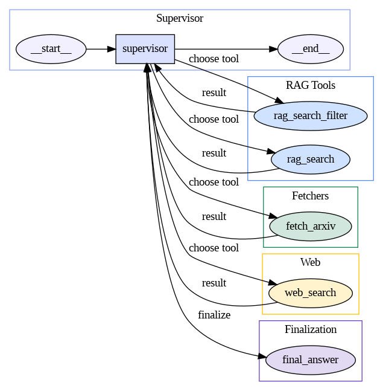

# 🧠 ArXiv Research Supervisor Agent  
*A LangGraph-based RAG System for Automated Scientific Literature Synthesis*

---

## 📘 Overview
This project implements an **AI-driven research workflow** that autonomously retrieves, analyzes, and synthesizes information from academic literature and the public web.  
It leverages **LangGraph**, **LangChain**, and **OpenAI models** to perform multi-step reasoning across multiple data sources (ArXiv, Pinecone RAG, and web search) to produce structured academic summaries.

This system serves as a proof-of-concept for **autonomous research orchestration**, where an intelligent “Supervisor Agent” dynamically decides which retrieval or reasoning tool to invoke next — all within a self-contained, explainable graph.

---

## ⚙️ Core Components

| Component | Description |
|------------|-------------|
| **Supervisor Agent** | Orchestrates the workflow by choosing the next best tool based on context and prior results. |
| **RAG Tools** | Perform semantic retrieval using a Pinecone vector index, returning highly relevant academic text chunks. |
| **Fetchers** | Collect academic papers or abstracts directly from the ArXiv API. |
| **Web Search** | Uses SerpAPI or similar connectors to fetch the most recent and relevant scientific articles or press releases. |
| **Finalization** | Synthesizes retrieved results into a structured research report (introduction, main body, conclusion, sources). |

---

## 📊 System Diagram

<p align="center">
  
</p>

**Figure 1.** *Graph-based architecture of the ArXiv Research Supervisor Agent.*  
The **Supervisor** node governs all tool calls dynamically. It evaluates retrieved evidence, decides which tool to use next (`rag_search`, `fetch_arxiv`, `web_search`), and terminates with a structured `final_answer` once sufficient information has been gathered.

---

## 🧩 Key Features

- **Dynamic Tool Selection:**  
  The Supervisor decides the best next action at each reasoning step (no hard-coded logic).

- **RAG Integration:**  
  Uses Pinecone vector embeddings for semantic retrieval of scientific abstracts and metadata.

- **Multi-Source Fusion:**  
  Synthesizes findings from ArXiv, academic databases, and live web sources.

- **Structured Final Reports:**  
  Outputs complete research summaries with fields:  
  `introduction`, `research_steps`, `main_body`, `conclusion`, and `sources`.

---

## 🧠 Example Output

```json
{
  "introduction": "Single-cell RNA sequencing (scRNA-seq) is a powerful technique that allows researchers to analyze the gene expression of individual cells...",
  "research_steps": [
    "Conducted a web search for recent breakthroughs in single-cell RNA sequencing.",
    "Reviewed recent articles and reviews highlighting technological advancements and applications."
  ],
  "main_body": "Recent developments in single-cell RNA sequencing have been significant...",
  "conclusion": "The field of single-cell RNA sequencing continues to evolve rapidly...",
  "sources": [
    "https://www.sciencedirect.com/science/article/pii/S138917232500026X",
    "https://www.frontierspartnerships.org/journals/acta-biochimica-polonica/articles/10.3389/abp.2025.13922/full",
    "https://medicine.yale.edu/news-article/bridging-biology-and-ai-yale-and-googles-collaborative-breakthrough-in-single-cell-analysis/",
    "https://translational-medicine.biomedcentral.com/articles/10.1186/s12967-023-04123-4"
  ]
}
🧮 Technologies Used
Category	Technologies
Core Framework	LangGraph, LangChain, OpenAI GPT Models
Vector Store	Pinecone Serverless (Cosine Similarity)
Data Fetching	ArXiv API, SerpAPI Web Search
Tool Orchestration	Supervisor Agent with dynamic reasoning
Visualization	Graphviz Diagram of Workflow
Environment	Python 3.12, Colab / VS Code, dotenv

📦 Installation
bash
Copy code
git clone https://github.com/your-username/arxiv-research-agent.git
cd arxiv-research-agent
pip install -r requirements.txt
If running in Google Colab:

python
Copy code
!pip install langgraph langchain openai pinecone-client serpapi python-dotenv
🚀 Usage
Run the full reasoning loop
python
Copy code
result = run_pipeline(
    user_input="Summarize recent breakthroughs in single-cell RNA sequencing from q-bio.GN papers.",
    chat_history=[],
    max_steps=6
)

print(result)
Generate the human-readable report
python
Copy code
report = build_report(result["intermediate_steps"][-1].tool_input)
print(report)
🧩 Example Research Workflow
Supervisor chooses rag_search to retrieve academic papers.

Evaluates the results and calls web_search to enrich with newer publications.

Once sufficient context exists, calls final_answer.

A complete report is assembled with citations, structured text, and linked sources.

📚 Citation
If you use this work or extend it, please cite:

java
Copy code
@software{visco2025_arxiv_supervisor_agent,
  author = {Joseph Visco},
  title = {ArXiv Research Supervisor Agent: A LangGraph-based RAG System for Automated Scientific Literature Synthesis},
  year = {2025},
  url = {https://github.com/jvisco/arxiv-research-agent}
}
🧑‍💻 Author
Joseph Visco
Site Reliability & Data Engineering Specialist | Azure OpenAI | LangGraph R&D
📍 Farmingdale, NY
🔗 GitHub • LinkedIn

🧩 License
MIT License © 2025 Joseph Visco

